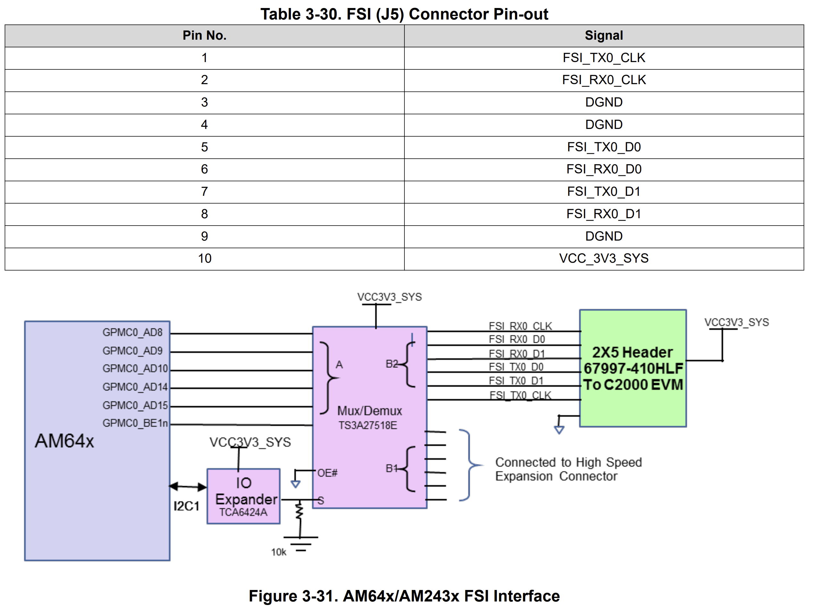
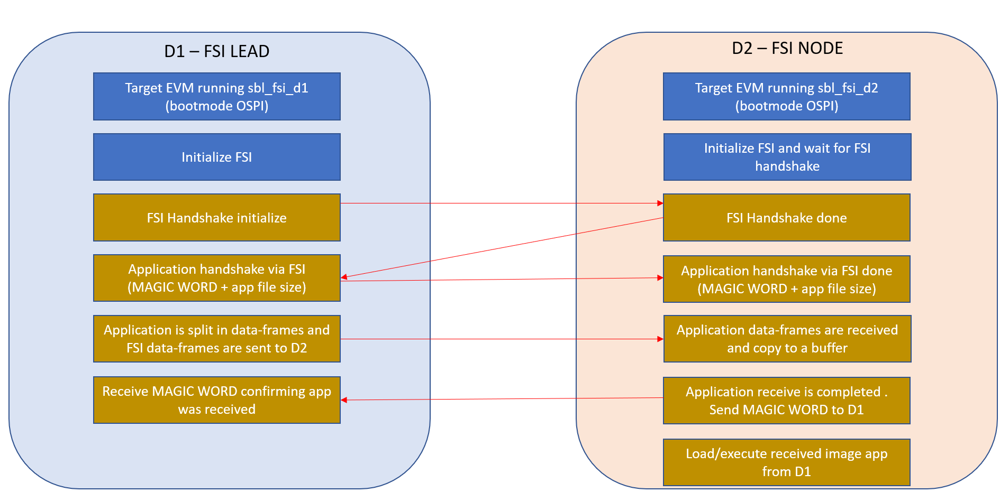

## AM243x SBL FSI

### HARDWARE:
- 2x AM243x EVM (TMDS243EVM - https://www.ti.com/tool/TMDS243EVM)
- 2x TMDSFSIADAPEVM Daughter cards (https://www.ti.com/lit/ug/swru555/swru555.pdf)
- FSI Interface (https://www.ti.com/lit/ug/spruj63a/spruj63a.pdf J5 or J7 depending on the EVM revision)

  <div align="center">
    
  </div>
 
- Connect each AM243x EVM with a "Fast Serial Interface (FSI) adapter board evaluation module" daughter card using ribbon cables. Follow the above pin-out connection.
- Use two Ethernet cables to connect between daughter cards (TMDSFSIADAPEVM)
  - Note: Between daughter cards, connect LVDS RX to LVDS TX
#### SETUP:

<div align="center">
  
</div>

### SOFTWARE:
- Install CCS
- Install AM243x MCU+SDK >9.2
    - Tested with MCU + SDK v10.1.0.32 and SysConfig v1.21.2

### STEPS:
- Connect boards as shown in the "SETUP" section
- D1's SD Card preparation:
    - Format to have a FAT partition
    - Add the image you want to transfer from D1 to D2, renamed as "app". This application will replace the flashed hello_world in D2
    - Insert SD Card into the AM243x EVM destined to be D1

- In the AM243x EVM destined to be D1, load "sbl_fsi_d1" application by following the steps below:
    - Import "sbl_fsi_d1_am243x-evm_r5fss0-0_nortos_ti-arm-clang" in CCS and rebuild
    - For testing, use CCS JTAG to load the sbl_fsi_d1 image. Alternatively, you can flash the image using the OSPI script
        - If using CCS JTAG to load/run sbl_fsi_d1, you can use **DEV BOOT MODE** or flash "default_sbl_null.cfg" and use **OSPI BOOT MODE**, both options are explained in the [AM243x MCU+SDK User Guide Flash SOC Initialization Binary](https://software-dl.ti.com/mcu-plus-sdk/esd/AM243X/latest/exports/docs/api_guide_am243x/EVM_SETUP_PAGE.html#EVM_FLASH_SOC_INIT)
        - If flashing "sbl_fsi_d1" image, modify OSPI script (tools\boot\sbl_prebuilt\am243x-evm\default_sbl_ospi.cfg) and switch the EVM boot mode to **OSPI BOOT MODE** as explained in the [AM243x MCU+SDK User Guide Flash a Hello World Example](https://software-dl.ti.com/mcu-plus-sdk/esd/AM243X/latest/exports/docs/api_guide_am243x/GETTING_STARTED_FLASH.html)
    - Now you are ready to power on D1

- In the AM243x EVM destined to be D2, load "sbl_fsi_d2" application by following the steps below:
    - Import "sbl_fsi_d2_am243x-evm_r5fss0-0_nortos_ti-arm-clang" in CCS and rebuild it
    - Flash "sbl_fsi_d2" as the bootloader using OSPI script (tools\boot\sbl_prebuilt\am243x-evm\default_sbl_ospi.cfg) and switch the EVM boot mode to **OSPI BOOT MODE** as explained in the [AM243x MCU+SDK User Guide Flash a Hello World Example](https://software-dl.ti.com/mcu-plus-sdk/esd/AM243X/latest/exports/docs/api_guide_am243x/GETTING_STARTED_FLASH.html)
        - "default_sbl_ospi.cfg" modification example: 
        ```bash
        # When sending bootloader make sure to flash at offset 0x0. ROM expects bootloader at offset 0x0
        --file="C:/Users/alice/workspace_ccstheia/sbl_fsi_d2_am243x-evm_r5fss0-0_nortos_ti-arm-clang/sbl_ospi.Release.hs_fs.tiimage" --operation=flash --flash-offset=0x0
        ```
    - Note: 
        - You can flash a dummy application; this will be later replaced with the application image received from D1
            - Example: 
            ```bash
            # When sending application image, make sure to flash at offset 0x80000 (default) or to whatever offset your bootloader is configured for
            --file="C:/Users/alice/workspace_ccstheia/hello_world_am243x-evm_r5fss0-0_nortos_ti-arm-clang/Debug/hello_world_am243x-evm_r5fss0-0_nortos_ti-arm-clang.appimage.hs_fs" --operation=flash --flash-offset=0x80000
            ```
    - Now you are ready to power on D2

- No particular order is required to power on or run D1 and D2 since FSI handshake is used

#### FSI LEAD (D1)
##### Application sbl_fsi_d1
Below is a brief explanation of sbl_fsi_d1:
- Configure I2C IO expander for FSI connection
- Initialize FSI
- Lead (D1) starts FSI handshake with node (D2)
- Retrieve an application image from the SD card and initiate the FSI handshake with D2 (node)
- The file image from /sd0/app is loaded into a buffer (gAppImageBuf) in MSRAM
    - Note: FreeRTOS FAT library and header files are used to load the application from SD Card to an internal buffer
- Application handshake:
    - D1 sends the MAGIC WORD to D2 to indicate readiness and transmits the application file size before starting application image transmission
- gAppImageBuf (buffer with loaded app) is divided into chunks based on the maximum FSI data frame size (16 words of 16 bits = 256 bits = 32 bytes) and sent in loopback to verify correct transmission and reception
- Care is taken to handle any remaining data if the image size is not evenly divisible by the data frame size
- Wait for MAGIC WORD from D2 signaling that the application image was received

#### FSI Node (D2)
##### Application sbl_fsi_d2
Below is a brief explanation of sbl_fsi_d2:
- D2 (node) has been flashed with a modified OSPI SBL to enable FSI modules
- Configure I2C IO expander for FSI connection
- Initialize FSI
- Perform the FSI handshake with D1
- After FSI handshake between D1 and D2 is completed, D2 waits for an application handshake (MAGIC WORD + file size)
- The file size gives D2 the information to know how many dataframes to expect. Care is taken to handle remaining data if the image is not evenly divisible by the dataframe size
- After application handshake is received, D2 starts receiving and saving dataframes in a buffer
- After D2 finishes receiving the application image, it sends a MAGIC WORD to D1 to confirm successful receipt of the application, and then D2 loads/executes the received image app from D1.

#### FSI SBL FLOW
<div align="center">
  
</div>

### CONSOLE OUTPUT D1 example:
```
Starting NULL Bootloader ...

DMSC Firmware Version 9.2.7--v09.02.07 (Kool Koala)
DMSC Firmware revision 0x9
DMSC ABI revision 3.1

INFO: Bootloader_runCpu:155: CPU r5f1-0  is initialized to 800000000 Hz !!!
INFO: Bootloader_runCpu:155: CPU r5f1-1 is initialized to 800000000 Hz !!!
INFO: Bootloader_runCpu:155: CPU m4f0-0 is initialized to 400000000 Hz !!!
INFO: Bootloader_loadSelfCpu:207: CPU r5f0-0 is initialized to 800000000 Hz !!!
INFO: Bootloader_loadSelfCpu:207: CPU r5f0-1 is initialized to 800000000 Hz !!!
INFO: Bootloader_runSelfCpu:217: All done, reseting self ...

[FSI] Lead - Loopback Interrupt application started at 40000000Hz ...
[FSI] Lead - starting handshake
[FSI] Lead - Handshake done
[FSI] Lead - Sending app image - "/sd0/app" of size 90110 Bytes
[FSI] Lead - MAGIC WORD and application file size sent
[FSI] Lead - fileSizeBytes: 90110, dataframeBytes: 32
[FSI] Lead - loopCnt: 2815, remainderBytes: 30
[FSI] Lead - TX/RX dataframe loopCnt:0
[FSI] Lead - TX/RX dataframe loopCnt:1
........
[FSI] Lead - TX/RX dataframe loopCnt:2813
[FSI] Lead - TX/RX dataframe loopCnt:2814
[FSI] Lead - TX/RX finished sending remainder words: 15
[FSI] Lead - MAGIC WORD matched, application was received
[FSI] 2815 frames successfully received!!!
All tests have passed!!
```

### CONSOLE OUTPUT D2 example:
```
DMSC Firmware Version 10.0.8--v10.00.08 (Fiery Fox)
DMSC Firmware revision 0xa
DMSC ABI revision 4.0

FSI started sending image application...
FSI Node - Loopback Interrupt application started at 1000000Hz...
FSI Node - initFSI
FSI Node - Starting handshake
FSI Node - Handshake done
FSI Node - fileSizeBytes: 90110, dataframeBytes: 32
FSI Node - loopCnt: 2815, remainderBytes: 30
FSI Node - RX/TX dataframe loopCnt:0
FSI Node - RX/TX dataframe loopCnt:1
........
FSI Node - RX/TX dataframe loopCnt:2813
FSI Node - RX/TX dataframe loopCnt:2814
FSI Node - RX/TX finished receiving remainder words: 15
FSI Node - Sent MAGIC WORD - Application received
FSI Node - frames successfully received!!!
All tests have passed!!
FSI completed sending image application...
KPI_DATA: [BOOTLOADER_PROFILE] Boot Media       : NOR SPI FLASH
KPI_DATA: [BOOTLOADER_PROFILE] Boot Media Clock : 166.667 MHz
KPI_DATA: [BOOTLOADER_PROFILE] Boot Image Size  : 0 KB
KPI_DATA: [BOOTLOADER_PROFILE] Cores present    :
r5f0-0
KPI_DATA: [BOOTLOADER PROFILE] SYSFW init                       :      11078us
KPI_DATA: [BOOTLOADER PROFILE] System_init                      :     364326us
KPI_DATA: [BOOTLOADER PROFILE] Drivers_open                     :       1682us
KPI_DATA: [BOOTLOADER PROFILE] Board_driversOpen                :     123310us
KPI_DATA: [BOOTLOADER PROFILE] Sciclient Get Version            :       9989us
KPI_DATA: [BOOTLOADER PROFILE] CPU load                         :    3235441us
KPI_DATA: [BOOTLOADER PROFILE] SBL End                          :          4us
KPI_DATA: [BOOTLOADER_PROFILE] SBL Total Time Taken             :    3745834us

Image loading done, switching to application ...
Hello World! - App image received from D1
```