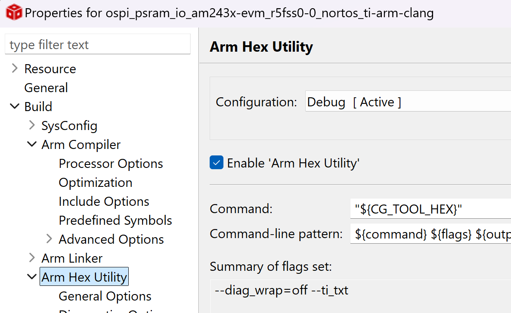
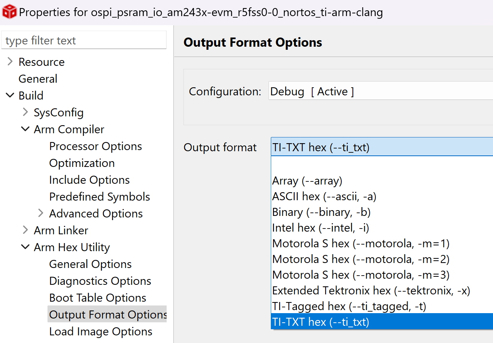
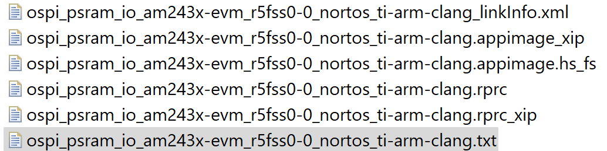
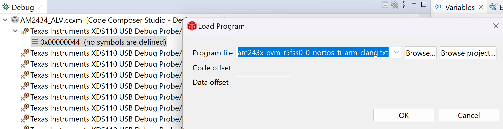
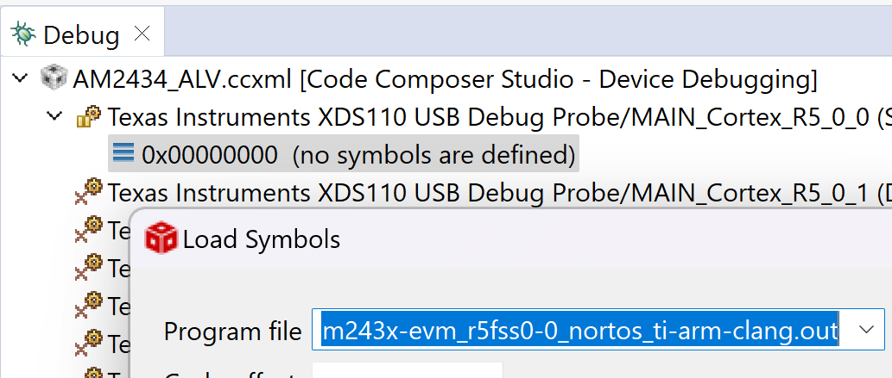

## AM243x OSPI PSRAM

### HARDWARE:

#### EVM Modification Schematic:
- PROC101E1_OSPI_SCH_AM243x.pdf

#### High Speed Switch:
- IO Expander is used to set OSPI_SW_SEL
#### Note: 
- There is a 10K pull-down on OSPI_SW_SEL to default to OSPI FLASH

#### PSRAM datasheet:
- [APM_PSRAM_OPI_Xccela_APS6408L_3OBMx_v3_5b_PKG-1954852.pdf](https://www.mouser.com/datasheet/2/1127/APM_PSRAM_OPI_Xccela_APS6408L_OBMx_v3_5b_PKG-1954880.pdf)


### SOFTWARE:

#### MCU+SDK changes
  - Apply patch mcu_sdk_10_0_0_20_ospi_psram.patch from mcu sdk root folder, which does the following:
    - Added PSRAM to board lib
    - OSPI driver changes 
- Libs rebuild example:
  ```bash
  cd C:\ti\mcu_plus_sdk_am243x_10_00_00_20
  gmake libs PROFILE=debug
  ```
#### Notes:  
- Don't forget to update CCS version and other tools in `imports.mak`
- Fix for undeclared NULL error. Add in `psram.c`
  ```c
  #include <stddef.h>
  ```
- In case of errors building libs, you can use "libs-clean" and "libs-scrub" before retrying to build. Also, repeat for PROFILE=release if needed.

#### Notes:
  - I2C:
    - I2C1 instance used.
    - Added "io_expander.c" to CCS project to configure IO expander by using TCA6424 APIs (`ioexp_tca6424.h`).
      - Used `TCA6424_Params_init()` which sets I2C address to 0x22
      - "ioIndex=19" which correspond to Pin23 (20)→ OSPI_SW_SEL.
          - LOW → OSPI FLASH
          - HIGH → OSPI_RAM
  - APS6408 Driver:
    - Header file for PSRAM configuration (`ospi_psram_aps6408.h`)
    - STIG Mode functions (`fss_config.h`)
    - `psram_ospi.c` implements:
      - `Psram_ospiRead()`, `Psram_ospiWrite()`, `Psram_ospiOpen()`, and `Psram_ospiClose()`
        - Write and read could be setup to DAC or INDAC modes.
  - `ospi_psram_io.c` implements a test application which writes, then read back and compares a buffer

#### XIP Test application
  - Created a sample testcode() inside ".psram_code" section
    __attribute__ ((section(".psram_code"))) void testcode(void)
  - PSRAM is a volatile memory. Therefore, testcode() can only reside in PSRAM after OSPI PSRAM is configured and enabled during application initialization, i.e., after Board_psramOpen().
  - Initially, the testcode() is located in MSRAM at address 0x70140000. It is then copied to PSRAM at address 0x60000000.
  - Next, the application copies the code back to another MSRAM location at 0x70150000 to verify data integrity. This step ensures that PSRAM initialization is correct and that read and write operations to PSRAM are functioning properly.
  - Finally, the testcode() function is executed.
  - The testcode() function is a dummy function used to verify variable manipulation, console prints, and pointer operations.

#### CCS Project   
- Import project in CCS.
##### CCS project changes:
Below changes, as mentioned above, are required as current test application configure and enables OSPI PSRAM after application is running (compared to being ready after booting). 
  - Enable "Arm Hex Utility"
    
  - Select TI-TEX binary
    
  - After rebuilding the application, a binary ".txt" is now created.
    
  - Open ".txt" binary file, search for "@60000000" (PSRAM address) and manually change it to @70140000, which is an MSRAM location which we will temporarily use to copy from there the code (testcode()) which will run in PSRAM 
  - Launch "Target configuration" and load ".txt" program file
    
  - Then load ".out" as symbols
    
  - Run the project

### CONSOLE OUTPUT example:
[MAIN_Cortex_R5_0_0] PSRAM Manufacturer ID : 0xD
PSRAM Device ID: 0x2
PSRAM code write pass
Starting XIP
Hi, I am executing from PSRAM!
Finished OSPI PSRAM XIP test!