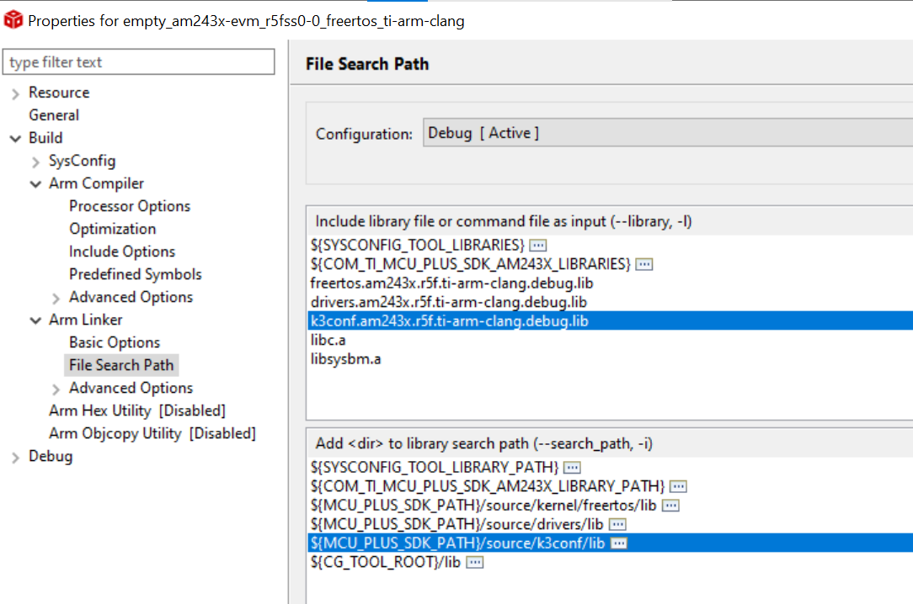
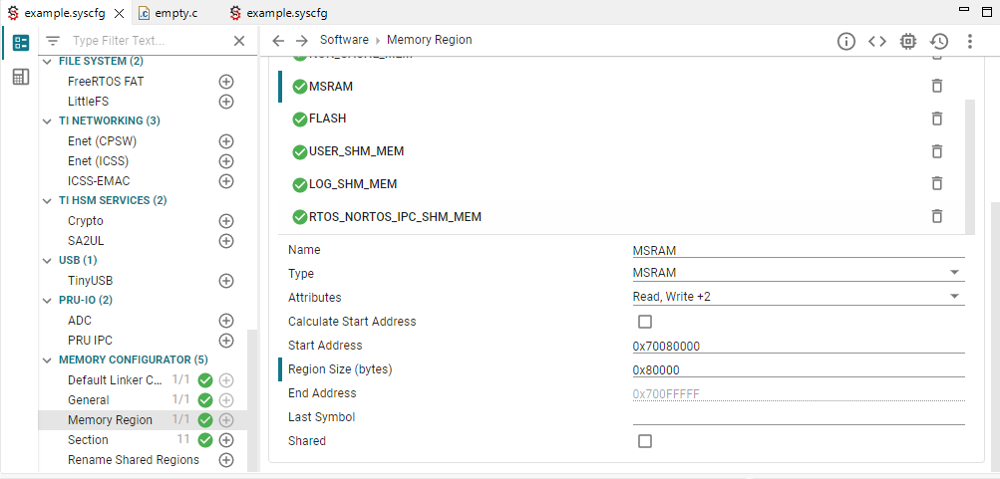
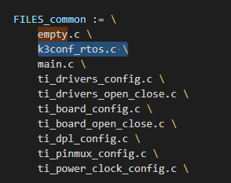
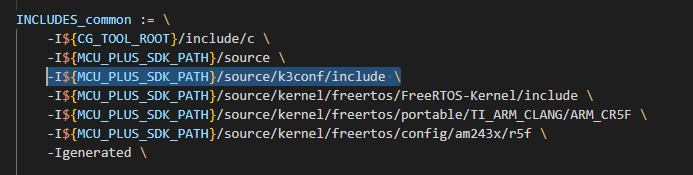
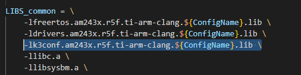
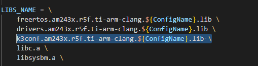
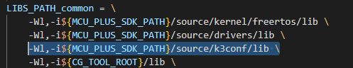
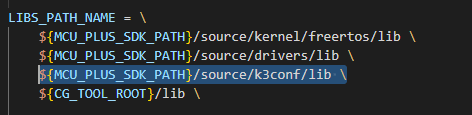

###############################################################################
#                                                                             #
#                                   K3CONF RTOS                               #
#                                                                             #
#    A Powerful Diagnostic Tool for Texas Instruments K3 based Processors     #
###############################################################################


**INTRODUCTION:**
-----------------

K3CONF RTOS is a standalone application designed to provide a
quick'n easy way to dynamically diagnose Texas Instruments' K3 architecture
based processors. K3CONF is intended to provide similar experience to that of
OMAPCONF that runs on legacy TI platforms.

**WARNING**: This is work in progress! Don't expect things to be complete in any
dimension. Use at your own risk. And keep the reset button in reach.

**DISCLAIMER**: Follow the below steps to integrate and run the k3conf tool in your existing project. 
We are taking `empty project` as base to show the integration steps, you are free to integrate the tool in your project following the below steps.

**SUPPORT:**
-------------

K3CONF RTOS currently supports AM243x devices.


**Integration of k3conf tool in SDK:**
-------------------------------------------------------------
Navigate to the k3conf source directory from beyond-sdk repo.\
```cd ${Repo}/am243x/tools/k3conf/source```

Copy the K3conf tool at path `${MCU+SDK}/source`\
```cp -r k3conf ${MCU+SDK}/source```


**Build the K3conf tool:**
--------------------------------------------------------
Go to the root directory of K3conf RTOS tool in MCU+SDK\
```cd ${MCU+SDK}/source/k3conf```

Build the k3conf tool \
```gmake -s -f makefile.am243x.r5f.ti-arm-clang PROFILE=${debug|release}```

That's it!! Now the k3conf tool is ready to use in the SDK.

**Using CCS to build k3conf example:**
-----------------------------------
1. Copy the k3conf_main function in the your_example project.

2. Create a freeRTOS task and provide k3conf_main function's pointer to the task.

3. Add libraries and path dependencies in CCS as shown below. Open properties of example project and add libs path to it.



4. Please configure the UART ports accordingly in the application and also update the size of MSRAM as shown in below section.



5. Refer to SDK documentation and follow the steps mentioned at `Using SDK with CCS`.

**Using Makefiles to build k3conf example:**
------------------------------------------

1. Go to the root directory of MCU+SDK.
```cd ${MCU+SDK}```

2. Copy the k3conf_rtos.c file  in the empty project.
```cp ${Repo}/am243x/tools/k3conf/k3conf_rtos.c  examples/empty/```

3. Create a freeRTOS task in the main.c file and provide k3conf_main function's pointer to the task.

4. Open the makefile of the empty project and add the dependency as shown below.

\
\
\
\
\
\

5. Open the example.syscfg file and configure UART of your choice to output the Debug Logs.

6. Configure the MSRAM region to have size of `0x80000` as shown below.

\

7. Refer to SDK documentation and follow the steps mentioned at `Using SDK with Makefiles`.
